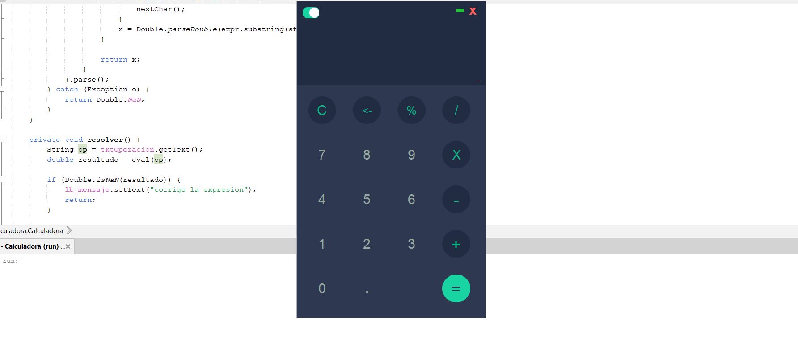

# Calculadora Básica

Una calculadora simple desarrollada en Java usando la interfaz gráfica de usuario (GUI) de NetBeans. Esta aplicación permite realizar operaciones matemáticas básicas como suma, resta, multiplicación, división, y más.

## Características

- Suma, resta, multiplicación y división.
- Soporte para operaciones de porcentaje.
- Interfaz gráfica de usuario (GUI) simple.

## Interfaz

### Pantalla principal de la calculadora:

### Cálculo de una operación (Ejemplo: 5 + 2):

## Requisitos

- JDK (Java Development Kit) 8 o superior.
- NetBeans IDE para ejecutar el proyecto.
